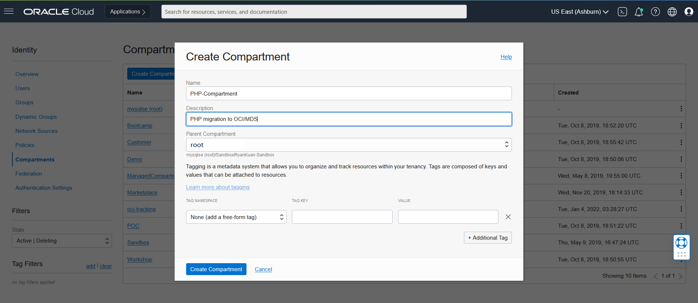

# Lab 1: Requirements 

## Introduction
Before you start to provision any OCI resources, it is a good practice to create a **compartment** as an isolated environment for your work. 
In this lab, we will create a compartment for all the OCI resources required to host our PHP application

Estimated lab time: 10 minutes

## Task 1: Create Compartment

1. Log in to **OCI** and navigate to **Compartment**

2. Specify the name of the compartment such as **PHP-Compartment** with a description, click on **Create Compartment**

Alright, you are done and ready to move to Lab 2

[Home](../README.md) | [**Go to Lab 2 >>>>>**](../lab2/README.md)

