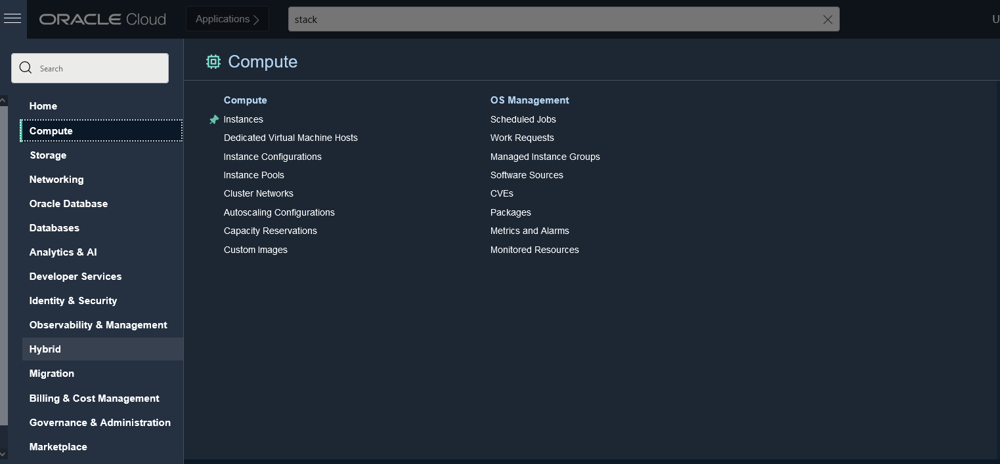
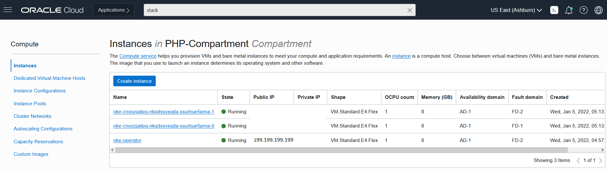

# Lab 3: Upload data to MySQL Database System

## Introduction
**MySQL Database System (MDS)** is a fully-managed cloud-native database service based on the MySQL Enterprise Edition. 

In this lab, we will walk you through the steps to upload the data into **MDS** using mysql shell.

Estimated lab time: 10 minutes

## Task 1: Connect to Bastion Host

1. Log in to **OCI** and click on the <a href="#menu">&#9776; hamburger menu</a> at the top left corner of the OCI console, and select **Compute**, anc click on **Instances**



2. Find out the **Public IP** of the compute instance **oke-operator**, we will need this to connect to the compute instance to load the data into **MDS**



3. Connect to the Bastion host using your favorite ssh client with the private key

```
<copy>ssh opc@ip_address -i id_rsa</copy>
```

## It works

You just created a compartment!

## Congratulations, you are ready for the next Lab!

[Home](../README.md) | [**Go to Lab 2 >>>>>**](../lab2/README.md)

