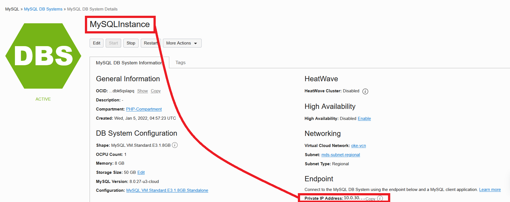

# Lab 3: Upload data to MySQL Database System

## Introduction
**MySQL Database System (MDS)** is a fully-managed cloud-native database service based on the MySQL Enterprise Edition. 

In this lab, we will walk you through the steps to upload the data into **MDS** using mysql shell.

Estimated lab time: 10 minutes

## Task 1: Connect to Bastion Host

1. Log in to **OCI** and click on the <a href="#menu">&#9776; hamburger menu</a> at the top left corner of the OCI console, and select **Compute**, anc click on **Instances**


2. Find out the **Public IP** of the compute instance **oke-operator**, we will need this to connect to the compute instance to load the data into **MDS**


3. Connect to the Bastion host using your favorite ssh client with the private key using the **opc** user id

```
ssh opc@ip_address -i id_rsa
```


4. Download the database (airportdb) export required by the PHP application

```
cd /home/opc
```
```
wget -O airport-db.zip https://bit.ly/3pZ1PiW
```


5. Unpack the downloaded zip file

```
unzip airport-db.zip
```
```
cd airport-db
ls
```


6. Next we need to connect to the provisioned MDS instance. Click on the <a href="#menu">&#9776; hamburger menu</a> at the top left corner of the OCI console, and select **Databases**, anc click on **DB System**


7. Select the provisioned MDS instance, **MDSInstance**


8. Find out the private ip of **MDSInstance**


10. Connect to MDS instance

```
mysqlsh --user=admin --password=**PASSWORD** --host=<mysql_private_ip_address> --port=3306 --js
```

## It works

You just created a compartment!

## Congratulations, you are ready for the next Lab!

[Home](../README.md) | [**Go to Lab 2 >>>>>**](../lab2/README.md)

