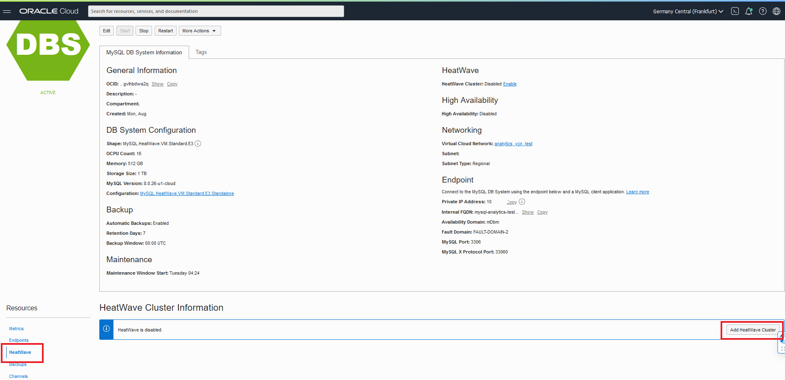
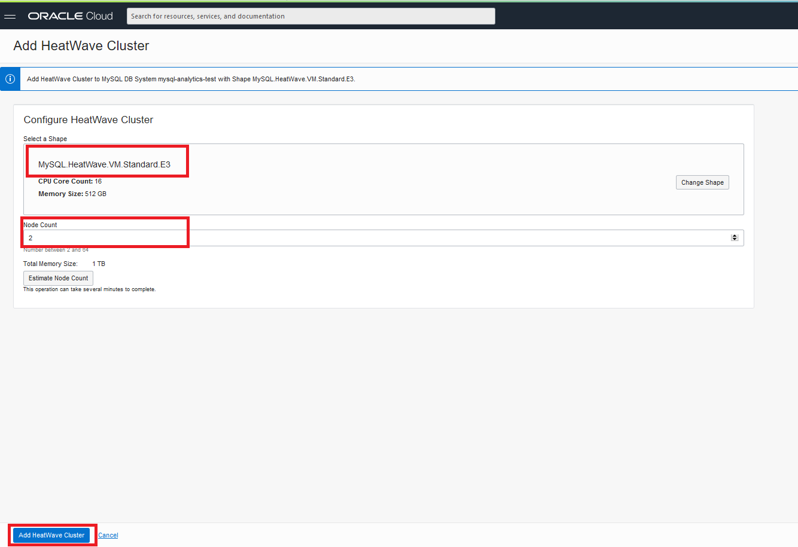
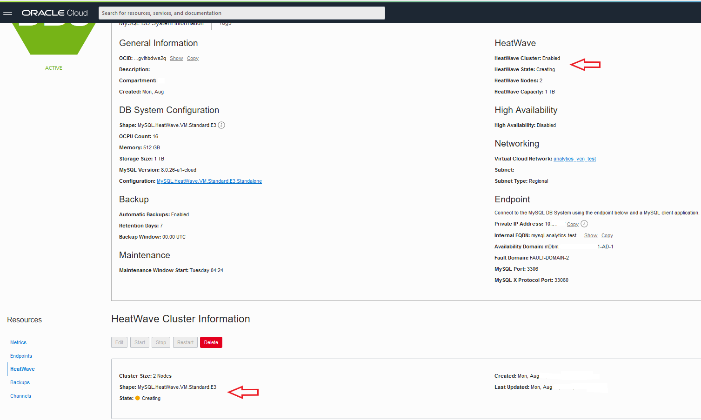

# Lab 5: Accelerate your application

## Introduction

In this lab we will enable the HeatWave cluster and accelerate your long running queries. The DB System and HeatWave cluster must use the same shape, the shape defines the number of CPU cores, the amount of RAM, and so on. The size of the HeatWave cluster needed depends on tables and columns required to load, and the compression achieved in memory for this data. By enabling HeatWave you will deploy a standalone DB System characterized by a HeatWave-compatible shape (MySQL.HeatWave.VM.Standard.E3) and 1TB of data storage that will accelerate processing of analytic queries. For more information, check HeatWave Documentation. 

Estimated lab time: 15 minutes

Task 1: Add HeatWave Cluster to MySQL Database Service 
1. Navigate to MDS console by clicking on the <a href="#menu">&#9776; hamburger menu</a>, select **Databases**, and click on **DB System**

2. Select the **MDSInstance**

3. From the menu on the left bottom side select HeatWave, and click on the button Add HeatWave Cluster located on the right.

4. Check that Shape looks as per picture below and that Node Count is set to 2, and then click the button Add HeatWave Cluster.

5. You will be brought back to the main page where you can check for the creation status. After some seconds you should see the nodes in Creating status.

6. After completion, the node status will switch to Active status. The process will take some time to be completed. You can go to the next Task in the meantime.

## It works

You have just turned on the turbo engine on MySQL and accelerated your long running queries with HeatWave!

## Congratulations, you are ready for the next lab

[Home](../README.md) | [**Go to Lab 6 >>>>>**](../lab6/README.md)

